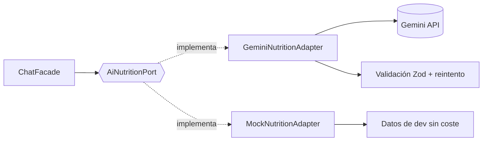

<div align="center">

# 🥗 NutrIA

**Registra lo que comes escribiendo en lenguaje natural. La IA hace el resto.**

Una app móvil de nutrición *local-first*: escribes *"un plato de lentejas y una manzana"*
en un chat, **Gemini** lo interpreta, calcula calorías y macros, y todo se guarda
**solo en tu dispositivo**. Sin cuentas, sin servidores, sin rastreadores.


</div>

<!-- ────────────────────────────────────────────────────────────────────────
  📸 CAPTURA 1 — HERO
  Qué: la pantalla de chat (pestaña "Registrar") justo después de registrar
       una comida, mostrando la tarjeta de resultado con macros y el rango.
  Cómo: modo OSCURO (es el que mejor luce), móvil, con 1-2 mensajes ya en el
       chat para que se vea el flujo "texto → tarjeta con datos".
  Archivo: docs/screenshots/01-hero-chat.png
──────────────────────────────────────────────────────────────────────────── -->
<div align="center">
  
</div>

---

## ✨ Qué hace

- 💬 **Registro por chat con IA** — describe la comida con tus palabras; Gemini
  estima calorías y macros. Si escribes un alimento básico sin cantidad
  (*"arroz"*), te pregunta los gramos; si es un plato compuesto, lo deduce.
- 📊 **Rangos de macros** — muestra el mínimo–máximo de cada macro (la IA no
  inventa un número exacto falso) pero suma el día con el valor central.
- 📷 **Registro por foto** — haz una foto del plato y la IA identifica los
  alimentos (Gemini multimodal).
- 🔦 **Escáner de código de barras** — macros desde Open Food Facts (ML Kit).
- 🎯 **Objetivos y TDEE adaptativo** — calcula tus necesidades y las **recalibra**
  según tu peso real semana a semana.
- 📈 **Progreso** — gráfica de peso, insights semanales y racha de constancia.
- 💧 **Agua, favoritos, recordatorios** — hidratación, comidas de un toque,
  y notificaciones locales (comidas / pesaje / copia de seguridad).
- 🔒 **Seguridad de datos** — copia automática, restauración al reinstalar y
  export/import manual (Drive, email). Todo bajo tu control.
- 🌗 **Tema claro/oscuro** con un sistema de diseño propio basado en tokens.

---

## 🎬 Demo

<!-- ────────────────────────────────────────────────────────────────────────
  🎥 DEMO (lo más importante para un portfolio)
  Opción A (recomendada): un GIF de 15-25 s del flujo completo:
       abrir chat → escribir "pechuga de pollo 200g y arroz" → ver la tarjeta
       con macros → pestaña "Hoy" con los anillos rellenándose.
       Graba la pantalla del emulador/móvil y conviértelo a GIF.
  Opción B: enlace a un vídeo (YouTube/Loom) y/o a una demo web desplegada
       (build web con el adaptador Mock, sin necesidad de clave).
  Archivo del GIF: docs/screenshots/demo.gif
──────────────────────────────────────────────────────────────────────────── -->

<div align="center">
  
</div>

> 🔗 **Demo web:** **https://zanderzr.github.io/NutrIA/** — funciona entera en el
> navegador (los datos se guardan en tu IndexedDB). Para el registro por IA
> necesitas pegar tu propia clave gratuita de Gemini en el onboarding; el resto
> —dashboard, progreso, favoritos, agua— se puede probar sin clave.

---

## 🖼️ Capturas

<!-- ────────────────────────────────────────────────────────────────────────
  📸 GALERÍA — 4 capturas en fila (GitHub respeta esta tabla).
  Todas en modo OSCURO, mismo dispositivo, con datos de ejemplo cargados
  (varias comidas del día) para que las pantallas no salgan vacías.
──────────────────────────────────────────────────────────────────────────── -->

| Registrar (chat) | Hoy (dashboard) | Progreso | Onboarding |
|:---:|:---:|:---:|:---:|
|  |  |  |  |
| Registro por lenguaje natural | Anillos de macros + racha | Gráfica de peso + insights | Objetivo con previsión en vivo |

**Guía de captura (qué debe mostrar cada una):**

| Archivo | Pantalla | Qué capturar |
|---|---|---|
| `02-chat.png` | Pestaña **Registrar** | Un par de comidas registradas con sus tarjetas de macros y rango visibles. |
| `03-hoy.png` | Pestaña **Hoy** | Los anillos de macros parcialmente llenos + kcal restantes + la racha. |
| `04-progreso.png` | Pestaña **Progreso** | La gráfica de peso con varios puntos + un insight semanal. |
| `05-onboarding.png` | **Onboarding** | El paso de objetivo con la previsión de calorías/macros actualizándose. |
| `06-foto.png` *(opcional)* | **Registrar → foto** | Una foto de un plato con el resultado del análisis de la IA. |
| `07-privacidad.png` *(opcional)* | **Ajustes → Privacidad** | La pantalla legal (refuerza la historia *local-first*). |

> 💡 Consejo: usa siempre el **mismo dispositivo/emulador y el modo oscuro** para
> que la galería se vea coherente. Un marco de móvil (mockup) le da un plus.

---

## 🏗️ Arquitectura

Clean architecture pragmática con **puertos y adaptadores** (hexagonal) en los dos
puntos que tocan el mundo exterior: la IA y la búsqueda de alimentos.

```
features/*            Presentación — páginas y componentes Ionic (standalone)
   │
core/state/*          Aplicación — facades con signals (ChatFacade, DashboardFacade…)
   │
domain/*              Dominio — reglas puras, sin Angular
   │                    (nutrition-calculator, adaptive-tdee, streak, insights)
   │
data/* · core/*       Infraestructura — repositorios sobre SQLite, adaptadores de IA,
                        notificaciones, backup, secure storage
```

El puerto de IA permite **cambiar Gemini por un mock** (o por otro proveedor)
sin tocar el resto de la app:



**Carpetas clave** en `src/app/`:

| Carpeta | Rol |
|---|---|
| `domain/` | Modelos + reglas puras (`nutrition-calculator`, `adaptive-tdee`, `objective.strategy`, `insights/`). Sin Angular, testeable de forma aislada. |
| `data/` | Repositorios (`MealRepository`, `ProfileRepository`…) + mappers sobre SQLite. |
| `core/database/` | `DatabaseService` + migraciones versionadas. |
| `core/ai/` | Puerto `AiNutritionPort`, `GeminiNutritionAdapter`, `MockNutritionAdapter`, prompts y validador **Zod**. |
| `core/food/` | Puerto de código de barras + adaptador Open Food Facts + escáner ML Kit. |
| `core/state/` | Facades con signals que la UI consume. |
| `core/config/` | `SecureConfigService` (clave API cifrada en el dispositivo). |
| `core/backup/` · `core/notifications/` | Copias de seguridad y notificaciones locales. |
| `shared/` | Componentes reutilizables (`macro-ring`, `nutrient-bar`) y utilidades. |
| `features/` | `onboarding`, `chat`, `dashboard`, `history`, `stats`, `settings`, `legal`, `tabs`. |

---

## 🧠 Decisiones técnicas destacadas

Las partes que más cuentan sobre cómo está construida:

- **Integración de IA de nivel producción, no un `fetch` a pelo.** Salida JSON
  garantizada con el `responseSchema` de Gemini, **validada con Zod** y con un
  **reintento correctivo** si el modelo devuelve algo inesperado. Errores
  **tipados** (`AiError` con `kind`: `no-key`, `auth`, `rate-limit`, `network`…)
  que la UI traduce a mensajes claros, y `AbortController` para que el chat nunca
  se quede colgado.
- **Local-first como decisión de producto.** Sin cuentas ni backend: SQLite en el
  dispositivo con migraciones versionadas. En web corre sobre `jeep-sqlite`
  (IndexedDB) para poder desarrollar el flujo completo sin móvil.
- **BYOK (*bring your own key*).** Cada usuario pone su propia clave de Gemini,
  guardada cifrada — coste de operación cero y privacidad por diseño. Incluye un
  botón *"probar clave"* que valida sin gastar cuota.
- **Rangos de macros honestos.** La IA devuelve min–max por macro en vez de un
  número exacto ficticio; el día se suma con el valor central. Modela la
  incertidumbre real de estimar comida a ojo.
- **TDEE adaptativo.** Las necesidades calóricas se recalibran con el peso real
  observado semana a semana, no se quedan en el cálculo inicial.
- **Sistema de diseño propio** con tokens CSS y tema claro/oscuro, en lugar de
  usar los estilos de Ionic por defecto.

---

## 🛠️ Stack

**Angular 18** (standalone + signals) · **Ionic 8** · **Capacitor 6** ·
**TypeScript** · **SQLite** (`@capacitor-community/sqlite` + `jeep-sqlite`/`sql.js`
en web) · **Zod** · **Chart.js** · **Google Gemini** (`gemini-flash-lite-latest`) ·
**ML Kit** (barcode) · **Open Food Facts**.

---

## 🚀 Ejecutar en local

```bash
npm install            # instalar dependencias
npm start              # servir en web → http://localhost:4200
npm run build          # build de producción a /www
npm run cap:android    # build + sync + abrir Android Studio
npm run cap:ios        # build + sync + abrir Xcode
```

Para usar la IA necesitas una clave gratuita de Gemini
([Google AI Studio](https://aistudio.google.com/app/apikey)); pégala en el
onboarding o en **Ajustes → IA**.

### 🧪 Demo sin gastar tokens

Para recorrer todo el pipeline (parse → persistir → dashboard) **sin clave y sin
coste**, cambia el binding del puerto de IA en `src/main.ts`:

```ts
import { MockNutritionAdapter } from './app/core/ai/mock-nutrition.adapter';
// ...
{ provide: AI_NUTRITION_PORT, useClass: MockNutritionAdapter },
```

Es también la forma de desplegar una demo pública que no pida clave a nadie.

### 🌐 Despliegue web

[`.github/workflows/deploy.yml`](.github/workflows/deploy.yml) publica la build en
GitHub Pages en cada push a `master`. El `--base-href` se deriva del nombre del
repositorio, así que sigue siendo correcto si se renombra. La demo desplegada usa
el adaptador real de Gemini (BYOK): cada visitante pone su clave, que se queda en
su navegador.

---

## ✅ Tests

```bash
npm run test:ci        # unit tests headless (Karma + Jasmine)
```

Foco en la lógica de dominio y la capa de IA (más valor por test):
`domain/nutrition/nutrition-calculator.spec.ts`,
`core/ai/ai-response.validator.spec.ts`.

---

## 🗺️ Roadmap

- Publicación en Google Play (la política de privacidad ya está lista, ver
  [`docs/PRIVACY.md`](docs/PRIVACY.md)).
- Micronutrientes (azúcares, grasas saturadas, sodio).
- Sincronización con Google Fit / Apple Health.
- Internacionalización (i18n) — hoy la app está en español.

---

<div align="center">
  <sub>Hecho con Angular, Ionic y Capacitor · Local-first · BYOK</sub>
</div>
